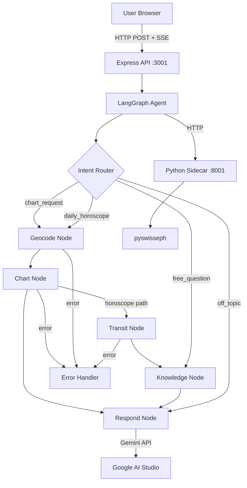

# Aradhana (AstroAgent) 🌟
> A warm, wise, and mathematically precise spiritual astrology companion.

Aradhana is a full-stack conversational agentic AI application. It allows users to cast their exact birth charts using the professional Swiss Ephemeris (`pyswisseph`), calculate accurate Placidus house cusp positions, query planet details, fetch real-time planetary transits for any given day, and ask general astrological questions. All of this is delivered via a stunning, highly premium, responsive React user interface featuring elegant typography, HSL tailored dark-mode, micro-animations, and live SSE streaming logs of active background agent node calculations.

---

## 🏗️ Architecture Design



### Key Technical Choices
- **Agent Orchestration**: **LangGraph.js** v0.2+ is used to define a robust `StateGraph` with custom routers, linear pipelines, conditional edges, error recovery nodes, and a runaway loop budget guard.
- **Precision Ephemeris**: A custom **FastAPI Python sidecar** is built around `pyswisseph` (C-extension Swiss Ephemeris) to perform accurate astronomical calculations and Placidus house subdivisions.
- **RAG Knowledge Base**: A fast, in-memory **BM25 Search Engine** indexes a 1,200+ word astrology notes library covering zodiac signs, planets, houses, aspects, retrogrades, and transits, delivering contextual facts to Gemini.
- **SSE Streaming**: Express handles server-sent event (SSE) connections to stream word-level output tokens, intermediate tool triggers, status updates, and error state transitions directly to React.
- **Vibrant UX**: Built using React 18, Vite, Tailwind CSS, and Zustand. Form validation, persistent caching, starry animations, responsive grid sidebars, and collapsing elements deliver a world-class experience.

---

## 📋 Prerequisites
Ensure the following tools are installed on your environment:
- **Node.js** 20+
- **Python** 3.11+
- **Google AI Studio API Key**: Acquire a free key at [Google AI Studio](https://aistudio.google.com).

---

## 🚀 Setup & Execution

Perform the following steps in sequence:

### 1. Configure Environment Variables
Copy `.env.example` in both backend and sidecar directories, and paste your Google AI API key:

```bash
# In backend directory
cp backend/.env.example backend/.env

# In ephemeris-sidecar directory
cp ephemeris-sidecar/.env.example ephemeris-sidecar/.env
```

Ensure `backend/.env` contains your API key:
```env
GOOGLE_AI_API_KEY=your-gemini-api-key-here
LLM_MODEL=gemini-2.5-flash
EPHEMERIS_SIDECAR_URL=http://localhost:8001
PORT=3001
ALLOWED_ORIGINS=http://localhost:5173
```

### 2. Start the Python Ephemeris Sidecar
The sidecar handles the Swiss Ephemeris and timezone resolution libraries:
```bash
cd ephemeris-sidecar
pip install -r requirements.txt
uvicorn main:app --port 8001 --reload
```
Health Check: Open [http://localhost:8001/health](http://localhost:8001/health) to verify (`{"status":"ok"}`).

### 3. Start the Express Backend
In a new terminal window, start the main LangGraph and API server:
```bash
cd backend
npm install
npm run dev
```

### 4. Start the React Frontend
In a new terminal window, spin up the Vite development server:
```bash
cd frontend
npm install
npm run dev
```
Open [http://localhost:5173](http://localhost:5173) to load the application!

---

## 🧪 Running the Evaluation Harness
We have designed a 25-case golden set evaluation suite covering:
1. Valid Chart Queries (`TC01-TC06`)
2. Daily Horoscope Requests (`TC07-TC10`)
3. Free Astrology Inquiries (`TC11-TC14`)
4. Invalid Birth Coordinate Data (`TC15-TC18`)
5. Off-Topic Filtering (`TC19-TC21`)
6. Adversarial Instructions & Safeguards (`TC22-TC25`)

To execute the automated evaluation checks and compute performance/latency scores:
```bash
cd eval
npm install
npm run eval
```
This script will:
- Fire exact test inputs to your active backend.
- Run deterministic checks (keyword matches, banned phrases, tool count limits, graceful failures).
- Grade outcomes using **Gemini LLM-as-a-Judge** against strict rubrics (Warmth, Accuracy, Relevance).
- Generate a summary in `eval/scorecard.md`.
- Log metrics (P50/P95 latencies, tool averages, failure rates) in `eval/results_log.csv`.
- Prompt you for a random human spot-check validation.

---

## ⚠️ Known Limitations
- **No Database Persistence**: Sessions and chat history are held in memory by the Express API. Restarting the server resets the session cache.
- **Birth Time Unknown Fallback**: If birth time is unchecked, computations fall back to 12:00 PM (Noon) UTC. While planet signs remain mostly identical, Placidus house subdivision coordinates should be treated as approximate.
- **Moshier Analytical Model**: The sidecar uses the Swiss Ephemeris analytical Moshier approximation (accurate between 1800 and 2100). It is extremely lightweight and requires no heavy external ephemeris data files.
- **Word-Level Streaming**: Token-by-token streaming is approximated at the Express controller level by splitting the compiled model response.
